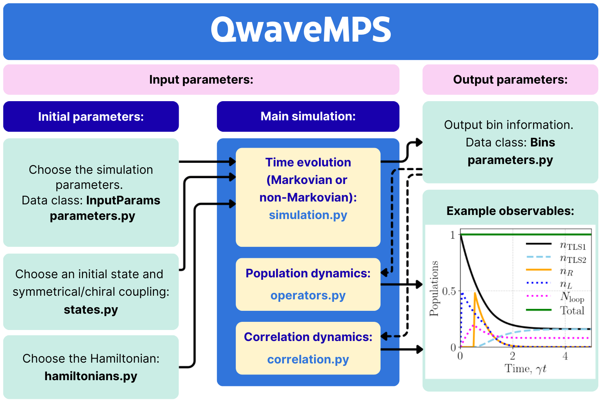
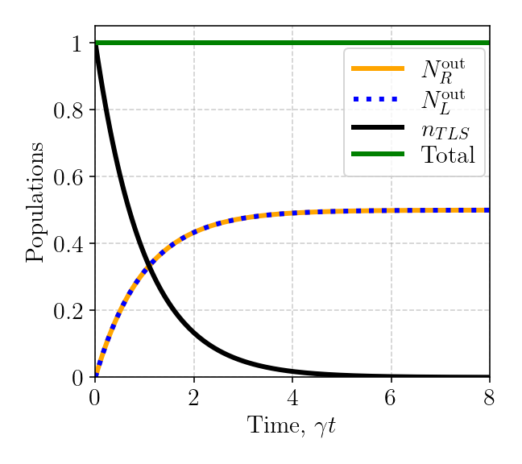

# QwaveMPS
> QwaveMPS is an open-source Python package that calculates light-matter interactions in waveguide QED systems using Matrix Product States, allowing one to study delayed feedback effects in the non-Markovian regime.

QwaveMPS is an open-source Python library for simulating one-dimensional quantum many-body systems using Matrix Product States (MPS). Designed for researchers and students, it provides a user-friendly interface for constructing, evolving, and analyzing quantum states and operators, facilitating studies in quantum physics and quantum information. This approach enables efficient, scalable simulations by focusing computational resources on the most relevant parts of the quantum system. Thus, one can study delayed feedback effects in the non-Markovian regime at a highly reduced computational cost compared to full Hilbert space approaches, making it practical to model open waveguide QED systems.

## Features

- **Nonlinear non-Markovian waveguide-QED problems:** Solve problems involving multiphoton and multiatom systems with time-delayed feedback.
- **Matrix product states (MPS):** Based on MPS theory for efficient numerical exact results that do not rely on Monte Carlo simulations.
- **Open-source Python package:** Python library with minimal dependencies on external packages.
- **User-friendly framework:** Designed to be accessible for researchers and students.
- **Comprehensive Resources:** Documentation and examples provided to support learning and usage.

## Installation

This package can be installed using the following command:
```
pip install QwaveMPS
```
<!--For now I am cloning the repository, going to the root folder, and installing it with 
```
pip install .
```
To be able to use the first option, we need to first publish it in PyPI. -->
  
## Usage

The following diagram summarizes the QwaveMPS framework, showing the main input and output parameters. For detailed usage information, see our [documentation](docs/usage.md).




## Simple example: Population dynamics of a TLS in an infinite waveguide

Import the necessary packages:
```python
import numpy as np
import QwaveMPS.src as qmps
```
Define the simulation parameters:
```python
delta_t = 0.05
tmax = 8
tlist=np.arange(0,tmax+delta_t,delta_t)
d_t_l=2 #Size of right-channel time bin (choose 2 for 1 photon per bin)
d_t_r=2 #Size of left-channel time bin 
d_t_total=np.array([d_t_l,d_t_r])

d_sys1=2 # tls bin dimension
d_sys_total=np.array([d_sys1]) #total system bin
```
Choose the initial state and coupling:
```python
i_s0=qmps.states.i_se() #TLS initially excited
i_n0 = qmps.states.vacuum(tmax, delta_t, d_t_total) #waveguide in vacuum
gamma_l,gamma_r=qmps.coupling('symmetrical',gamma=1)
```
Choose the Hamiltonian:
```python
Hm=qmps.hamiltonian_1tls(delta_t, gamma_l, gamma_r,d_sys_total,d_t_total)
```
Calculate time evolution of the system:
```python
sys_bins,time_bins,cor_bins,schmidt = qmps.t_evol_mar(Hm,i_s0,i_n0,delta_t,tmax,bond,d_sys_total,d_t_total)
```
Calculate population dynamics:
```python
pop,tbins_r,tbins_l,int_n_r,int_n_l,total=qmps.pop_dynamics(sys_bins,time_bins,delta_t,d_sys_total,d_t_total)
```
Plot of population dynamics:



## Contributing
Check our [contributing guidelines](docs/contributing.md) for details on how to contribute to QwaveMPS.

## Citing

Once we have the paper/arxiv, add here how to cite the repo

## License

QwaveMPS is distributed under the GNU GPLv3. See [LICENSE](LICENSE) for more information.

## Acknowledgements

Add acknowledgements here.

## Contact
For questions or support, open an issue or email [18sar4@queensu.ca](mailto:18sar4@queensu.ca).
